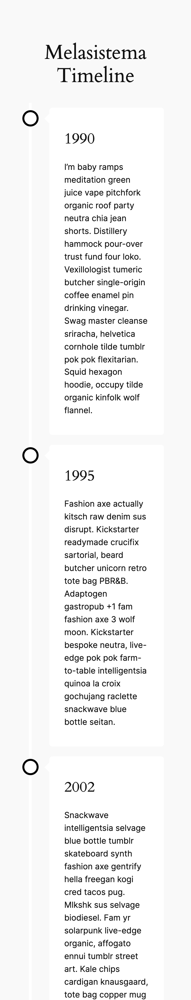

# Timeline - WordPress Plugin

This plugin for [WordPress](https://github.com/WordPress/WordPress) provides a simple vertical timeline, visually appealing and interactive for your website. It allows you to display historical events, processes or sequences in chronological order. The timeline is fully responsive, ensuring a smooth user experience on all devices.

## Main Features

* **Vertical Timeline:** Present your events in a vertical format that facilitates navigation and understanding.
* **Responsive:** The timeline automatically adapts to any screen size, ensuring an optimal user experience on all devices.

## Installation

1. **Download the plugin:** Clone or download the plugin repository via Git.
2. **Positioning in the WordPress plugin folder:** Move the plugin folders to the wp-content/plugins directory of your WordPress project.
3. **Activation of the plugin:** Go to Plugins in your WordPress administration dashboard and activate the "Timeline" plugin.

## Usage

* **Creating the Timeline:** Add events to your timeline by entering the year in the post_title and the corresponding description.
* **Add shortcode:** Use the shortcode **[melasistema-timeline]** to display your timeline on a page or post.

## License

This plugin is distributed under the terms of the GPLv2 or later (GPL) license. You can find more details on the [LICENSE](http://www.gnu.org/licenses/gpl-2.0.html).

## Screenshots

